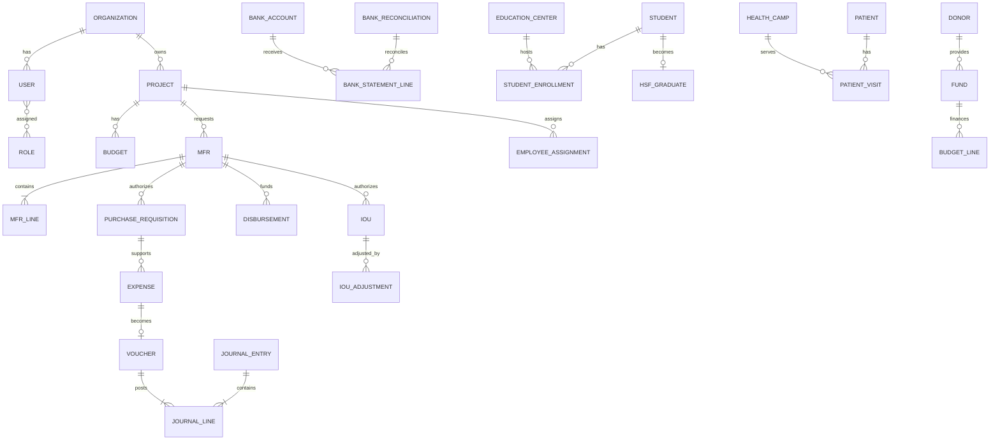
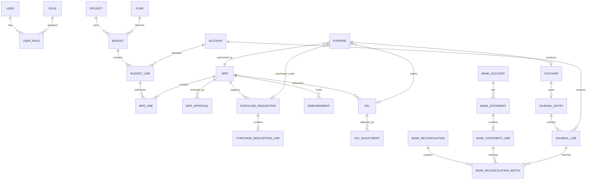

# HSF ERP

## Data Model, Database Design, and ERD Specification

**Database:** PostgreSQL  
**Architecture:** Modular monolith  
**Document status:** Draft v1.0  
**Purpose:** Define the logical and physical data model for HSF ERP

---

# 1. Data Design Principles

1. Use UUID primary keys.
2. Use human-readable document numbers separately from primary keys.
3. Use immutable audit history.
4. Use soft deletion only where legally and operationally appropriate.
5. Never hard-delete posted financial transactions.
6. Separate master records from transaction records.
7. Separate patient master from patient visits.
8. Separate student master from academic enrolments.
9. Separate natural account from project, fund, activity, and location dimensions.
10. Use explicit statuses rather than inferred states.
11. Store all timestamps in UTC.
12. Display dates in the user's configured timezone.
13. Use decimal or numeric data types for money.
14. Store currency code with financial values where multi-currency may apply.
15. Use unique constraints for controlled document numbers.
16. Use optimistic locking or version fields for high-risk workflows.
17. Encrypt or mask sensitive fields where appropriate.

---

# 2. Shared Columns

Most transactional tables should include:

```text
id                  UUID PRIMARY KEY
organization_id     UUID NOT NULL
created_at          TIMESTAMPTZ NOT NULL
created_by          UUID
updated_at          TIMESTAMPTZ NOT NULL
updated_by          UUID
version             INTEGER NOT NULL DEFAULT 1
status              ENUM or VARCHAR
deleted_at          TIMESTAMPTZ NULL
deleted_by          UUID NULL
```

Financial and approval records should additionally include:

```text
submitted_at
submitted_by
approved_at
approved_by
posted_at
posted_by
closed_at
closed_by
```

---

# 3. High-Level Domain Model



---

# 4. Core Platform Entities

## 4.1 organization

| Field                   | Type     | Notes                     |
| ----------------------- | -------- | ------------------------- |
| id                      | UUID     | Primary key               |
| legal_name              | VARCHAR  | Human Safety Foundation   |
| short_name              | VARCHAR  | HSF                       |
| registration_no         | VARCHAR  | NGO registration          |
| country_code            | CHAR(2)  | BD                        |
| timezone                | VARCHAR  | Asia/Dhaka                |
| default_currency        | CHAR(3)  | BDT                       |
| fiscal_year_start_month | SMALLINT | Confirm before production |
| status                  | VARCHAR  | Active, Inactive          |

## 4.2 user

| Field              | Type        | Notes                                  |
| ------------------ | ----------- | -------------------------------------- |
| id                 | UUID        | PK                                     |
| organization_id    | UUID        | FK                                     |
| supabase_user_id   | UUID        | Immutable Supabase Auth user/JWT `sub` |
| employee_id        | UUID NULL   | Optional employee link                 |
| email              | CITEXT      | Unique within organization             |
| phone              | VARCHAR     | Optional                               |
| preferred_language | VARCHAR     | en, bn                                 |
| status             | VARCHAR     | Active, Suspended, Disabled            |
| last_login_at      | TIMESTAMPTZ | Audit                                  |

Supabase Auth owns sign-in, sign-out, password reset, email verification,
authentication sessions, identity, and access-token and refresh-token issuance.
The ERP must not store a Supabase password hash.
Authentication through Supabase does not grant ERP access unless the linked
local HSF user and organization membership are active and local authorization
permits the action. The implementation design must decide whether this identity
link uses a cross-schema database constraint or application-enforced integrity
without allowing Prisma migrations to alter Supabase-managed auth tables.
Supabase user metadata, custom claims, and RLS must not replace authorization
from HSF ERP membership, role, permission, project, location, approval, account
status, separation-of-duties, and audit tables.

## 4.3 role

- id
- organization_id
- code
- name
- description
- is_system_role
- status

## 4.4 permission

- id
- code
- module
- action
- description

Examples:

```text
finance.mfr.create
finance.mfr.submit
finance.mfr.budget_check
finance.mfr.approve
finance.voucher.post
finance.period.close
education.student.view
health.patient.edit
```

## 4.5 user_role

- user_id
- role_id
- valid_from
- valid_to
- assigned_by

## 4.6 user_project_access

- user_id
- project_id
- access_level

## 4.7 user_location_access

- user_id
- location_id
- include_descendants
- access_level

## 4.8 audit_event

| Field           | Type        |
| --------------- | ----------- |
| id              | UUID        |
| organization_id | UUID        |
| user_id         | UUID        |
| entity_type     | VARCHAR     |
| entity_id       | UUID        |
| action          | VARCHAR     |
| before_data     | JSONB       |
| after_data      | JSONB       |
| reason          | TEXT        |
| ip_address      | INET        |
| user_agent      | TEXT        |
| created_at      | TIMESTAMPTZ |

---

# 5. Organizational Structure

## 5.1 project

| Field                   | Type      |
| ----------------------- | --------- |
| id                      | UUID      |
| code                    | VARCHAR   |
| name                    | VARCHAR   |
| description             | TEXT      |
| coordinator_employee_id | UUID NULL |
| start_date              | DATE      |
| end_date                | DATE NULL |
| status                  | VARCHAR   |

Initial codes:

- COM
- E4BL
- A2PHC
- CAI
- WEI

## 5.2 program

Allows cross-cutting or higher-level grouping.

Examples:

- Child Sponsorship Initiative
- Emergency Response
- MHPSS
- Nutrition
- Zakat Management

## 5.3 cost_center

- id
- code
- name
- project_id nullable
- parent_id nullable
- status

## 5.4 location

| Field      | Type         |
| ---------- | ------------ |
| id         | UUID         |
| code       | VARCHAR      |
| name       | VARCHAR      |
| type       | VARCHAR      |
| parent_id  | UUID NULL    |
| project_id | UUID NULL    |
| latitude   | NUMERIC NULL |
| longitude  | NUMERIC NULL |
| status     | VARCHAR      |

Location types:

- Country
- Division
- District
- Upazila
- Union
- Ward
- Village
- Office
- Education Center
- Health Service Point

## 5.5 fiscal_year

- id
- name
- start_date
- end_date
- status

## 5.6 financial_period

- id
- fiscal_year_id
- month_number
- start_date
- end_date
- status
- closed_at
- closed_by
- reopened_at
- reopened_by
- reopen_reason

---

# 6. Finance Master Data

## 6.1 account_group

- id
- code
- name
- class

Classes:

- Asset
- Liability
- Fund Balance
- Income
- Expense
- Control

## 6.2 account

| Field             | Type      |
| ----------------- | --------- |
| id                | UUID      |
| code              | VARCHAR   |
| name              | VARCHAR   |
| account_group_id  | UUID      |
| normal_balance    | VARCHAR   |
| parent_id         | UUID NULL |
| allows_posting    | BOOLEAN   |
| requires_project  | BOOLEAN   |
| requires_fund     | BOOLEAN   |
| requires_activity | BOOLEAN   |
| requires_location | BOOLEAN   |
| status            | VARCHAR   |

## 6.3 donor

- id
- code
- name
- donor_type
- country
- contact_person
- email
- phone
- status

## 6.4 fund

| Field            | Type      |
| ---------------- | --------- |
| id               | UUID      |
| code             | VARCHAR   |
| name             | VARCHAR   |
| donor_id         | UUID NULL |
| restriction_type | VARCHAR   |
| start_date       | DATE      |
| end_date         | DATE NULL |
| currency_code    | CHAR(3)   |
| status           | VARCHAR   |

Restriction types:

- Unrestricted
- Project Restricted
- Activity Restricted
- Beneficiary Restricted
- Zakat Restricted
- Emergency Restricted

## 6.5 activity

- id
- code
- name
- project_id nullable
- program_id nullable
- status

## 6.6 unit_of_measure

Examples:

- Person
- Student
- Patient
- Session
- Day
- Month
- Piece
- Box
- Pack
- Litre
- Kilometre

---

# 7. Budget Model

## 7.1 budget

| Field          | Type        |
| -------------- | ----------- |
| id             | UUID        |
| fiscal_year_id | UUID        |
| project_id     | UUID        |
| fund_id        | UUID NULL   |
| name           | VARCHAR     |
| version_no     | INTEGER     |
| status         | VARCHAR     |
| approved_at    | TIMESTAMPTZ |
| approved_by    | UUID        |

Statuses:

- Draft
- Submitted
- Approved
- Revised
- Superseded
- Closed

## 7.2 budget_line

| Field          | Type          |
| -------------- | ------------- |
| id             | UUID          |
| budget_id      | UUID          |
| account_id     | UUID          |
| activity_id    | UUID NULL     |
| location_id    | UUID NULL     |
| cost_center_id | UUID NULL     |
| annual_amount  | NUMERIC(18,2) |
| notes          | TEXT          |

Unique recommendation:

```text
UNIQUE (
  budget_id,
  account_id,
  COALESCE(activity_id),
  COALESCE(location_id),
  COALESCE(cost_center_id)
)
```

## 7.3 budget_monthly_allocation

- id
- budget_line_id
- financial_period_id
- amount

## 7.4 budget_revision

- id
- budget_id
- revision_no
- reason
- status
- requested_by
- approved_by
- effective_date

## 7.5 budget_revision_line

- revision_id
- budget_line_id
- previous_amount
- revised_amount
- delta_amount

## 7.6 Budget balance formula

```text
Available Budget =
Approved Budget
+ Approved Revisions
- Approved Commitments
- Posted Actual Expenditure
```

Commitments may include:

- Approved but not fully spent MFR
- Approved PR
- Purchase Order
- Unadjusted disbursement

The exact commitment hierarchy must avoid double counting.

---

# 8. MFR Model

## 8.1 mfr

| Field               | Type               |
| ------------------- | ------------------ |
| id                  | UUID               |
| document_no         | VARCHAR UNIQUE     |
| project_id          | UUID               |
| financial_period_id | UUID               |
| fund_id             | UUID NULL          |
| working_area_text   | TEXT               |
| request_date        | DATE               |
| requested_amount    | NUMERIC(18,2)      |
| approved_amount     | NUMERIC(18,2) NULL |
| amount_in_words     | TEXT               |
| mfr_type            | VARCHAR            |
| original_mfr_id     | UUID NULL          |
| reason              | TEXT NULL          |
| status              | VARCHAR            |
| submitted_by        | UUID               |
| submitted_at        | TIMESTAMPTZ        |
| approved_at         | TIMESTAMPTZ NULL   |

MFR types:

- Regular
- Additional
- Emergency

## 8.2 mfr_line

| Field            | Type               |
| ---------------- | ------------------ |
| id               | UUID               |
| mfr_id           | UUID               |
| account_id       | UUID               |
| activity_id      | UUID NULL          |
| location_id      | UUID NULL          |
| cost_center_id   | UUID NULL          |
| description      | TEXT               |
| quantity         | NUMERIC(14,3)      |
| unit_id          | UUID               |
| unit_cost        | NUMERIC(18,2)      |
| requested_amount | NUMERIC(18,2)      |
| approved_amount  | NUMERIC(18,2) NULL |
| remarks          | TEXT               |
| budget_line_id   | UUID               |

Constraint:

```text
requested_amount = quantity × unit_cost
```

The application may allow a controlled override with reason.

## 8.3 mfr_approval

- id
- mfr_id
- step_no
- role_id
- approver_user_id nullable
- decision
- comments
- decided_at

Decision values:

- Pending
- Approved
- Rejected
- Returned
- Skipped
- Delegated

## 8.4 mfr_attachment

May use the generic document table linked to MFR.

---

# 9. Purchase and Procurement Model

## 9.1 purchase_requisition

- id
- document_no
- project_id
- mfr_id
- requester_id
- request_date
- required_date
- purpose
- estimated_total
- status

## 9.2 purchase_requisition_line

- id
- purchase_requisition_id
- account_id
- item_description
- specification
- quantity
- unit_id
- estimated_unit_cost
- estimated_total
- location_id
- intended_user
- budget_line_id

## 9.3 vendor

- id
- code
- name
- contact_person
- phone
- email
- address
- tax_id nullable
- bank_details_encrypted nullable
- status

## 9.4 quotation

- id
- purchase_requisition_id
- vendor_id
- quotation_date
- total_amount
- attachment_document_id

## 9.5 purchase_order

- id
- document_no
- purchase_requisition_id
- vendor_id
- order_date
- total_amount
- status

## 9.6 goods_receipt

- id
- purchase_order_id
- receipt_date
- received_by
- location_id
- status
- notes

---

# 10. Disbursement and IOU Model

## 10.1 disbursement

| Field                   | Type          |
| ----------------------- | ------------- |
| id                      | UUID          |
| document_no             | VARCHAR       |
| mfr_id                  | UUID          |
| purchase_requisition_id | UUID NULL     |
| io_u_id                 | UUID NULL     |
| source_account_type     | VARCHAR       |
| bank_account_id         | UUID NULL     |
| cash_account_id         | UUID NULL     |
| mfs_account_id          | UUID NULL     |
| recipient_employee_id   | UUID NULL     |
| recipient_external_name | VARCHAR NULL  |
| disbursement_date       | DATE          |
| amount                  | NUMERIC(18,2) |
| payment_method          | VARCHAR       |
| reference_no            | VARCHAR       |
| status                  | VARCHAR       |

## 10.2 iou

| Field                 | Type          |
| --------------------- | ------------- |
| id                    | UUID          |
| document_no           | VARCHAR       |
| mfr_id                | UUID          |
| recipient_employee_id | UUID          |
| purpose               | TEXT          |
| issue_date            | DATE          |
| due_date              | DATE          |
| amount                | NUMERIC(18,2) |
| adjusted_amount       | NUMERIC(18,2) |
| returned_amount       | NUMERIC(18,2) |
| outstanding_amount    | NUMERIC(18,2) |
| status                | VARCHAR       |

## 10.3 iou_adjustment

- id
- iou_id
- adjustment_date
- submitted_by
- expense_amount
- returned_amount
- notes
- status
- verified_by
- verified_at

---

# 11. Expense and Accounting Model

## 11.1 expense

| Field                 | Type          |
| --------------------- | ------------- |
| id                    | UUID          |
| expense_no            | VARCHAR       |
| project_id            | UUID          |
| fund_id               | UUID          |
| account_id            | UUID          |
| activity_id           | UUID NULL     |
| location_id           | UUID NULL     |
| cost_center_id        | UUID NULL     |
| mfr_id                | UUID          |
| pr_id                 | UUID NULL     |
| iou_id                | UUID NULL     |
| vendor_id             | UUID NULL     |
| recipient_employee_id | UUID NULL     |
| expense_date          | DATE          |
| accounting_period_id  | UUID          |
| description           | TEXT          |
| amount                | NUMERIC(18,2) |
| payment_method        | VARCHAR       |
| status                | VARCHAR       |

## 11.2 voucher

- id
- document_no
- voucher_type
- expense_id nullable
- receipt_id nullable
- journal_entry_id nullable
- voucher_date
- description
- total_amount
- status
- verified_by
- posted_by

Voucher types:

- Payment
- Receipt
- Journal
- Contra
- Advance
- Adjustment

## 11.3 journal_entry

| Field               | Type        |
| ------------------- | ----------- |
| id                  | UUID        |
| document_no         | VARCHAR     |
| financial_period_id | UUID        |
| entry_date          | DATE        |
| source_type         | VARCHAR     |
| source_id           | UUID        |
| description         | TEXT        |
| status              | VARCHAR     |
| posted_at           | TIMESTAMPTZ |
| posted_by           | UUID        |

## 11.4 journal_line

| Field            | Type          |
| ---------------- | ------------- |
| id               | UUID          |
| journal_entry_id | UUID          |
| account_id       | UUID          |
| project_id       | UUID NULL     |
| fund_id          | UUID NULL     |
| activity_id      | UUID NULL     |
| location_id      | UUID NULL     |
| cost_center_id   | UUID NULL     |
| debit            | NUMERIC(18,2) |
| credit           | NUMERIC(18,2) |
| description      | TEXT          |

Constraint:

```text
SUM(debit) = SUM(credit)
```

---

# 12. Cash, Bank, and MFS Model

## 12.1 bank_account

- id
- code
- bank_name
- branch_name
- account_name
- account_number_encrypted
- currency_code
- opening_balance
- status

## 12.2 cash_account

- id
- code
- name
- location_id
- custodian_employee_id
- opening_balance
- status

## 12.3 mfs_account

- id
- code
- provider
- account_number_encrypted
- custodian_employee_id
- status

## 12.4 bank_statement

- id
- bank_account_id
- statement_start_date
- statement_end_date
- opening_balance
- closing_balance
- imported_at
- imported_by
- source_document_id

## 12.5 bank_statement_line

- id
- bank_statement_id
- transaction_date
- value_date
- description
- reference
- debit
- credit
- running_balance
- match_status

## 12.6 bank_reconciliation

- id
- bank_account_id
- financial_period_id
- statement_id
- ledger_balance
- statement_balance
- adjusted_balance
- difference
- status
- prepared_by
- approved_by
- approved_at

## 12.7 bank_reconciliation_match

- reconciliation_id
- bank_statement_line_id
- journal_line_id
- matched_amount
- match_type
- matched_by
- matched_at

## 12.8 internal_transfer

- id
- document_no
- from_account_type
- from_account_id
- to_account_type
- to_account_id
- transfer_date
- amount
- reference
- status
- journal_entry_id

---

# 13. HR and Payroll Model

## 13.1 employee

- id
- employee_no
- full_name
- designation
- department_id
- employment_type
- joining_date
- status
- phone
- email
- bank_account_name
- bank_account_number_encrypted
- bank_name
- branch_name

## 13.2 employee_assignment

- employee_id
- project_id
- location_id
- position_id
- supervisor_employee_id
- allocation_percentage
- valid_from
- valid_to

## 13.3 recruitment_requisition

- id
- position_id
- project_id
- location_id
- requested_by
- reason
- required_date
- status

## 13.4 candidate

- id
- vacancy_id
- full_name
- phone
- email
- cv_document_id
- status

## 13.5 payroll_period

- id
- financial_period_id
- earning_start
- earning_end
- payment_date
- status

## 13.6 salary_structure

- employee_id
- basic_salary
- allowances_json
- deductions_json
- effective_from
- effective_to

## 13.7 payroll_run

- id
- payroll_period_id
- status
- prepared_by
- approved_by
- total_gross
- total_deduction
- total_net

## 13.8 payroll_line

- payroll_run_id
- employee_id
- project_id
- gross_amount
- deduction_amount
- net_amount
- bank_account_id nullable
- payment_status

---

# 14. E4BL Data Model

## 14.1 education_center

- id
- code
- name
- location_id
- fee_policy
- status

Initial centres:

- Hazaribagh
- Uttara

## 14.2 academic_year

- id
- name
- start_date
- end_date
- status

## 14.3 class_level

- id
- code
- name
- sequence_no

Initial:

- Pre-primary
- Grade One
- Grade Two
- Grade Three
- Grade Four
- Grade Five

## 14.4 student

| Field                  | Type         |
| ---------------------- | ------------ |
| id                     | UUID         |
| student_no             | VARCHAR      |
| full_name              | VARCHAR      |
| date_of_birth          | DATE NULL    |
| gender                 | VARCHAR      |
| guardian_id            | UUID         |
| admission_date         | DATE         |
| vulnerability_category | VARCHAR NULL |
| status                 | VARCHAR      |
| photo_document_id      | UUID NULL    |

## 14.5 guardian

- id
- full_name
- relationship
- phone
- address
- occupation
- income_band nullable

## 14.6 student_enrollment

- id
- student_id
- academic_year_id
- education_center_id
- class_level_id
- roll_no
- admission_type
- fee_status
- status

Unique:

```text
UNIQUE(student_id, academic_year_id)
```

## 14.7 student_attendance

- id
- student_enrollment_id
- attendance_date
- status
- reason
- recorded_by

## 14.8 exam

- id
- academic_year_id
- education_center_id
- class_level_id
- name
- start_date
- end_date

## 14.9 exam_result

- id
- exam_id
- student_enrollment_id
- subject_id
- marks
- grade
- status

## 14.10 material_distribution

- id
- student_id
- item_id
- quantity
- distribution_date
- fund_id
- acknowledged_by

## 14.11 student_fee

- id
- student_enrollment_id
- financial_period_id
- amount_due
- waiver_amount
- amount_paid
- status

## 14.12 hsf_graduate

- id
- student_id
- grade_five_completion_year
- graduate_no
- high_school_name
- high_school_admission_date
- current_grade
- support_status

## 14.13 graduate_support

- id
- hsf_graduate_id
- support_type
- period
- amount
- fund_id
- payment_date
- voucher_id
- notes

## 14.14 sponsorship

- id
- donor_id
- student_id
- start_date
- end_date
- amount
- frequency
- status

---

# 15. A2PHC Data Model

## 15.1 health_camp

- id
- camp_no
- camp_date
- location_id
- project_id
- mfr_id
- supervisor_employee_id
- target_patients
- status

## 15.2 camp_team

- health_camp_id
- employee_id
- team_role

## 15.3 patient

| Field            | Type           |
| ---------------- | -------------- |
| id               | UUID           |
| patient_no       | VARCHAR UNIQUE |
| full_name        | VARCHAR        |
| date_of_birth    | DATE NULL      |
| age_years        | SMALLINT NULL  |
| gender           | VARCHAR        |
| phone_normalized | VARCHAR NULL   |
| location_id      | UUID           |
| consent_status   | VARCHAR        |
| status           | VARCHAR        |

Age validation:

```text
0 <= age_years <= 120
```

Exceptional ages require review.

## 15.4 patient_visit

- id
- visit_no
- patient_id
- health_camp_id
- visit_date
- visit_type
- physician_employee_id
- chief_complaint
- clinical_notes
- status

Visit type:

- New
- Follow-up

## 15.5 vital

- patient_visit_id
- systolic_bp
- diastolic_bp
- temperature
- pulse
- weight
- blood_glucose
- recorded_at

## 15.6 diagnosis

- id
- patient_visit_id
- diagnosis_code nullable
- diagnosis_text
- primary_flag

## 15.7 prescription

- id
- patient_visit_id
- physician_employee_id
- advice
- follow_up_date

## 15.8 prescription_item

- prescription_id
- medicine_item_id
- dosage
- frequency
- duration
- quantity

## 15.9 referral

- id
- patient_visit_id
- referred_to
- reason
- urgency
- referral_date
- completion_status
- completed_at

## 15.10 duplicate detection

A duplicate-review service should compare:

- Normalized name
- Phone
- Gender
- Age or birth date
- Location
- Visit date

Potential duplicates must be reviewed rather than automatically merged.

---

# 16. Donor and Grant Model

## 16.1 donation

- id
- receipt_no
- donor_id
- fund_id
- donation_date
- amount
- currency_code
- payment_method
- bank_account_id nullable
- restriction_notes
- receipt_document_id
- status

## 16.2 grant

- id
- donor_id
- fund_id
- title
- agreement_no
- start_date
- end_date
- approved_amount
- currency_code
- status

## 16.3 grant_reporting_schedule

- grant_id
- report_type
- due_date
- responsible_user_id
- status
- submitted_at

---

# 17. MEAL Model

## 17.1 project_plan

- id
- project_id
- fiscal_year_id
- status

## 17.2 plan_activity

- id
- project_plan_id
- activity_id
- responsible_user_id
- start_date
- end_date
- budget_line_id
- status

## 17.3 indicator

- id
- code
- name
- unit_id
- aggregation_method
- data_source
- frequency
- disaggregation_json
- status

Aggregation methods:

- Sum
- Count Unique
- Average
- Percentage
- Latest Value
- Cumulative

## 17.4 activity_target

- plan_activity_id
- indicator_id
- period_id
- target_value

## 17.5 achievement

- plan_activity_id
- indicator_id
- period_id
- actual_value
- narrative
- evidence_document_id
- verified_by
- verified_at

---

# 18. Document Management Model

## 18.1 document

- id
- organization_id
- file_name
- storage_key
- mime_type
- size_bytes
- checksum
- category
- uploaded_by
- uploaded_at
- confidentiality_level
- retention_until
- status

Confidentiality levels:

- Public
- Internal
- Confidential
- Restricted
- Medical Restricted
- Child Safeguarding Restricted

## 18.2 document_link

- document_id
- entity_type
- entity_id
- link_type

## 18.3 document_version

- document_id
- version_no
- storage_key
- uploaded_by
- uploaded_at
- change_note

---

# 19. Indexing Strategy

Important indexes:

```text
user(email)
project(code)
location(parent_id, type)
account(code)
fund(code)
budget(fiscal_year_id, project_id, status)
budget_line(budget_id, account_id)
mfr(project_id, financial_period_id, status)
mfr(document_no)
purchase_requisition(document_no)
iou(recipient_employee_id, status, due_date)
expense(project_id, accounting_period_id)
voucher(document_no)
journal_entry(financial_period_id, status)
bank_statement_line(bank_statement_id, transaction_date)
student(student_no)
student_enrollment(academic_year_id, education_center_id, class_level_id)
patient(patient_no)
patient(phone_normalized)
patient_visit(health_camp_id, visit_date)
audit_event(entity_type, entity_id, created_at)
```

Use partial indexes for active or pending workflow states where useful.

---

# 20. Data Integrity Rules

1. Document numbers are unique per organization.
2. MFR line totals equal quantity multiplied by unit cost unless overridden with reason.
3. Approved MFR total equals sum of approved lines.
4. Journal entries must balance.
5. Closed-period journal entries cannot be changed.
6. Internal transfers require both source and destination.
7. IOU outstanding amount equals issue less adjusted less returned.
8. Student may have only one active enrollment per academic year.
9. Patient visit must reference an active camp or approved service point.
10. Salary allocation percentages should total 100% for each payroll period.
11. Restricted funds may only be used for allowed projects or activities.
12. Deactivated master data cannot be used in new transactions.
13. A user cannot approve a record they requested where segregation of duties applies.
14. Attachments must inherit or exceed the confidentiality of the linked record.
15. Records with posted financial impact cannot be hard deleted.

---

# 21. Phase 1 ERD



---

# 22. Migration Staging Tables

Use staging tables for every import.

Examples:

- staging_account
- staging_employee
- staging_student
- staging_patient
- staging_payment
- staging_receipt
- staging_salary
- staging_bank_statement

Each row should include:

- source_file
- source_sheet
- source_row
- raw_data JSONB
- validation_status
- validation_errors JSONB
- matched_entity_id
- import_batch_id

This prevents unclean data from entering production tables directly.

---

# 23. Data Retention

Provisional guidance:

- Financial and audit records: minimum 10 years or according to applicable law and donor agreement
- Employee records: employment period plus required retention
- Patient records: according to medical privacy policy
- Child records: according to safeguarding and legal requirements
- System audit logs: minimum 7–10 years for high-risk actions
- Temporary import files: delete after approved retention period

Final retention policy requires legal and management confirmation.

---

# 24. Backup and Recovery

- Daily database backup
- Point-in-time recovery where supported
- Versioned object storage
- Encrypted backup
- Monthly restore test
- Separate backup credentials
- Documented recovery procedure
- Recovery Time Objective and Recovery Point Objective approved before go-live

---

# 25. Implementation Notes

- Use database transactions for posting vouchers, transfers, and payroll.
- Use idempotency keys for imports and payment operations.
- Use background jobs for PDF generation, large exports, notifications, and imports.
- Use row-level authorization in application services.
- Consider PostgreSQL Row Level Security only after the application permission model is stable.
- Avoid storing derived totals when they can be safely calculated, except where immutable posted snapshots are required.
- Use immutable posting snapshots for audit-sensitive financial reports.
